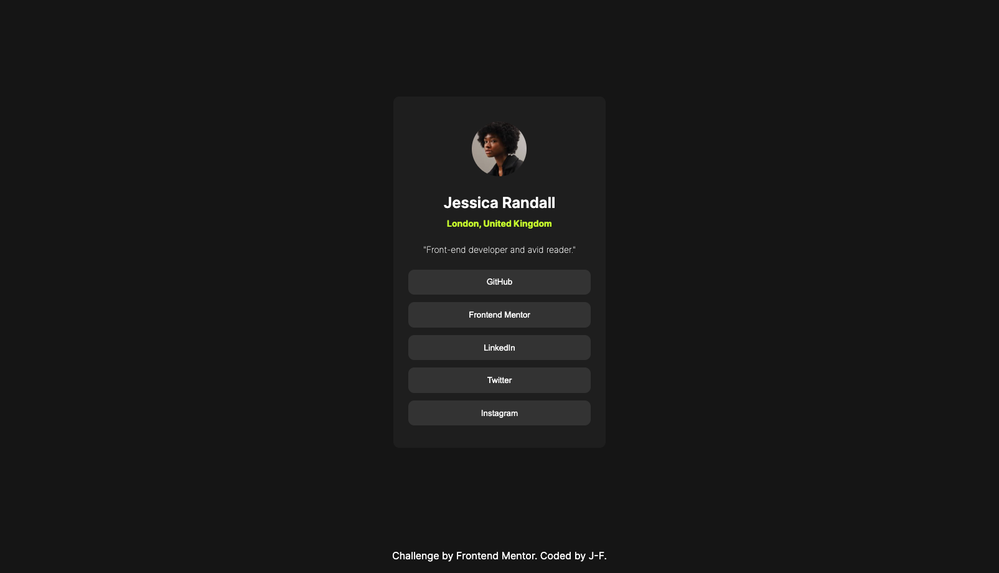
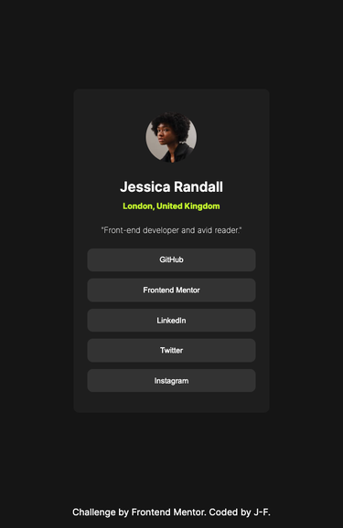

# Frontend Mentor - Social links profile solution

This is a solution to the [Social links profile challenge on Frontend Mentor](https://www.frontendmentor.io/challenges/social-links-profile-UG32l9m6dQ). Frontend Mentor challenges help you improve your coding skills by building realistic projects. 

## Table of contents

- [Overview](#overview)
  - [The challenge](#the-challenge)
  - [Screenshot](#screenshot)
  - [Links](#links)
- [My process](#my-process)
  - [Built with](#built-with)
  - [What I learned](#what-i-learned)
- [Author](#author)


## Overview

### The challenge

Users should be able to:

- See hover and focus states for all interactive elements on the page

### Screenshot




### Links

- Solution URL: [Add solution URL here](https://your-solution-url.com)
- Live Site URL: [Add live site URL here](https://your-live-site-url.com)

## My process

### Built with

- Semantic HTML5 markup
- CSS custom properties
- Flexbox
- CSS Variables


### What I learned

I've learnt that buttons behave differently with the flexbox property and so I've had to adapt the code accordingly.
I also learned how to use a png as a cursor.


```css
button{
    display:inline-block;
}
```
```css
button{
  cursor:url("./assets/images/up-sign.png"), pointer;
}
 ```

## Author

- Frontend Mentor - [@JFGEER83](https://www.frontendmentor.io/profile/JFGEER83)
- Twitter - [@JF46042899](https://twitter.com/JF46042899)


